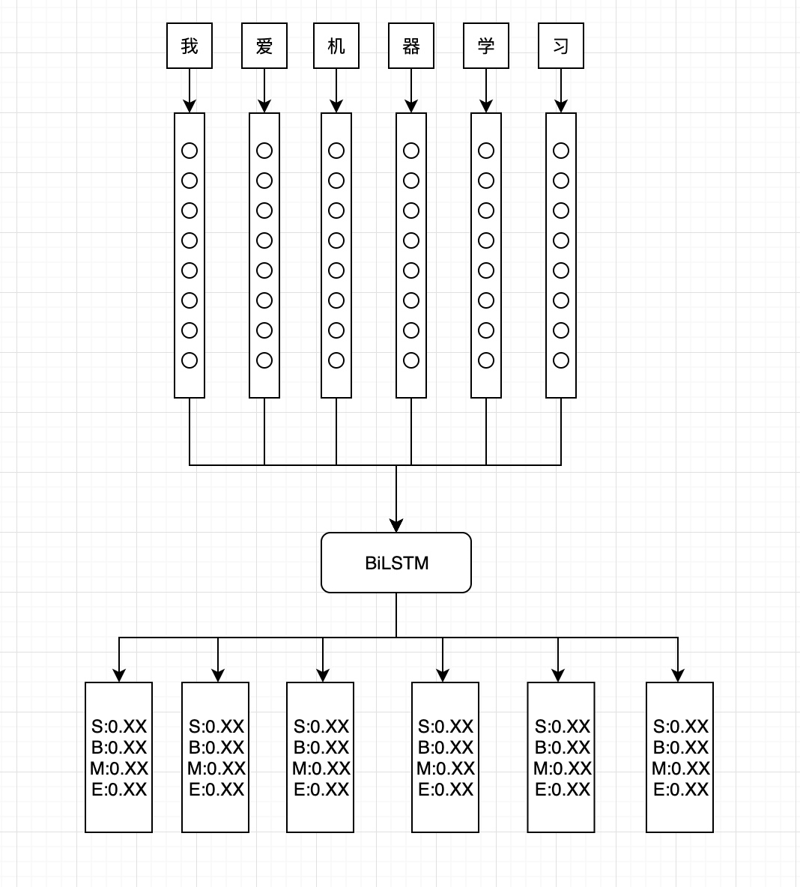

在前文当中，我们介绍了搜索引擎的大致原理。有错过或者不熟悉的同学，可以点击下方的链接回顾一下前文的内容。

在介绍爬虫部分的时候，我们知道，爬虫在爬取到网页的内容之后，会先进行一些处理。首先要做的就是过滤掉HTML当中的各种标签信息，只保留最原生的网页内容。之后，程序会对这些文本内容提取关键词。

今天我们就来讲讲关键词提取当中最重要的一个部分——中文分词。

在世界上众多的语言当中，中文算是比较特殊的一种。许多语言自带分词信息，比如英文，机器学习写作machine learning。machine和learning之间自带一个空格作为分隔。但是中文不是这样，汉字之间没有任何分隔符。意味着程序没有办法直接对文本进行分割。

那么我们怎么知道“机器学习”这四个字应该分割成机器和学习而不是机和器学习或者是机器学和习呢？

这就需要中文分词算法。

目前常用的分词算法主要分为两大类，一种是基于词表的规则分词算法。另一种则是在机器学习以及深度学习兴起之后流行起来的统计分词算法。我们先从比较容易理解的规则分词算法开始讲起。

规则分词算法的核心是词表，我们维护一个尽可能大的词表， 当中尽可能多的包含各种中文的词语。在切分语句的时候，我们将句子当中的每个短语都去词表当中检索。如果能够检索到，说明这的确是一个词语，则进行切分，否则则不切分。

这个很好理解对吧，我们继续往下。

但是我们切分语句的时候，其实有两种顺序，既可以正向切分，也可以反向切分。根据切分方向的不同，产生了两种比较类似的算法。

正向最大匹配算法

正向最大匹配算法的思路非常简单，我们每次尽量找尽可能长的词语。假设中文的词库当中最长的词语长度是n个字，那么我们每次从文本的前n个字开始查找词表， 如果找到了，那么显然这n个字就是一个单独的单词。如果没找到，那么缩减一位，查找前n-1个字，如此循环往复，直到在词表当中找到单词为止。

这时候， 我们从匹配结束的位置继续往下，一直到整个句子分词完毕。整个过程非常简单，理论上来说我们人类阅读句子的时候，就是按照这个顺序。但是这个算法并不是完美的，当中隐藏着问题。

举个最经典的例子，假设当前的句子是“南京市长江大桥”。假设我们词库当中单词的最长长度是5，那么我们第一次切分的结果是“南京市长江”，词表当中并没有这个词，于是会切分“南京市长”，词表当中的确有这个词，那么整个句子就会切分成“南京市长”和“江大桥”这两个部分。如果“江大桥”不被当做人名，那么会继续切分成“江”和“大桥”。

这显然是不对的，会发生这个问题的原因也很简单，因为中文当中存在歧义。尤其是掺杂人名的时候，因为人名数不胜数，不可能都包容在词表当中。如果真的包容了，也会很有问题。

逆向最大匹配算法

为了解决正向匹配算法当中的问题，人们又想出了逆向最大匹配算法。思路和正向匹配几乎一模一样，仅仅将切分的顺序从前面开始改成了从后面开始而已。

每次我们获取句子当中最后n个字，进行词表匹配。如果没有匹配中，那么去掉这n个字当中的第一个字，将后面的n-1个字继续匹配。直到能匹配上为止。

在实际应用当中，正相匹配的错误率约为1/169，而逆向匹配的错误率为1/245，显然逆向匹配要更好一些。这也是有原因的，因为汉语当中偏正短语较多，词语的重心往往落在后面，比如之前的”南京市长江大桥“如果按照逆向匹配，就很容易识别出”南京市“和”长江大桥“了。

当然和正向匹配一样，逆向匹配也不是完美的，同样存在许多反例。

双向最大匹配

双向最大匹配的原理也很简单，就是将正向和负向结合起来。互相各取所长，因为这两种算法的切分思路刚好相反，从逻辑上来看是存在互补的可能的。

实际上也的确如此，根据研究显示，约有90%的中文句子，正向和逆向的切分结果是完全匹配并且正确的。大约有9%的句子是两个算法结果不一致，并且是有一种是正确的。只有1%不到的句子，两个算法的结果都错误的。

算法的思路也很简单，就是将正向匹配和逆向匹配的结果进行对比。如果一致，那么直接就认为是正确答案，如果不一致，则选择其中切分出来单词数量较少的。

比如前文当中”南京市长江大桥“两种切分结果分别是”南京“，“市长”，“江”，“大桥”和“南京市”，“长江大桥”，那么算法会选择后者。

统计分词算法

基于统计的分词算法也不难理解，我们用统计学中出现的概率来代表分词方案的正确性。

假设句子是T，一种分词方案是$W_1, W_2, W_3...W_n$。那么$P(T) = P(W_1W_2W_3...W_n)=P(W_1)P(W_2|W_1)p(W_3|W_1W_2)...P(W_n|W_1W_2...W_{n-1})$

显然，我们要计算出当中所有的条件概率是不可能的，因为参数空间太大，数据过于稀疏。

不过好在我们可以进行化简，理论上来说当前句子某个位置会出现什么单词，可能和其他所有单词都有关系。但是我们可以简化这个关系，我们可以简单认为每个单词之和之前出现的两个词语有关。

也就是说

$$
P(W_3)=P(W_3|W_1W_2)\\
P(W_4)=P(W_2|W_1W_3)\\
\vdots\\
P(T)=\prod_{i=3}^nP(W_i|W_{i-1}W_{i-2})
$$

这样样本空间大大减少，我们枚举可能存在的分词情况，通过统计的方法找到其中出现概率最大的值即可。

深度学习分词算法

在深度学习普及了之后， 市面上出现了许多种基于深度学习的中文分词算法。本文选择其中最简单的一种作为介绍。

目前常用的模型是BiLSTM，即双向的LSTM模型。LSTM模型的好处是可以学到时间序列的信息，在文本当中，能够学习到上下文直接词语的内在联系。BiLSTM是双向LSTM模型，既考虑了句子的正序，也考虑了句子的逆序，有些类似于前文当中说的双向最大匹配算法。

模型的输入是一个句子当中所有汉字向量化的集合，有点类似于Word2vec的做法(这里看不懂的同学可以跳过，后面会有专门介绍Word2vec的文章)，以及每个字的类别。每个字的类别一共有四种，分别是s(single)，即单字成词，b(begin)，某个词语的开始，m(middle)，某个词语的中间部分和e(end)，即每个词语的结尾。

预测的时候，模型一样读入每个字对应的embedding，模型的预测结果是每个字属于每个类别的概率。最后，根据模型的预测结果，对整个文本完成分词。

和之前几种算法相比，这种算法的准确率更高，但是它也有自己的问题。最大的问题是非常依赖人工标注的结果，想要模型有好的结果，需要的训练样本量非常大，因此带来的人力成本很高。

中文分词是非常小的一个点，但是却至关重要，凡事和文本有关的领域都离不开它。好在绝大多数情况下，我们并不需要自己手动实现分词算法，因为如今市面上已经有了许多免费开源的分词引擎，像是著名的庖丁、solr等等。不过尽管如此，深入了解其中的算法原理，依然很有必要。

如果觉得文章有所帮助，请转发或者点击下方的赞助，你们的支持是我最好的回报。

> 参考资料
> Python自然语言处理实战：核心技术与算法

