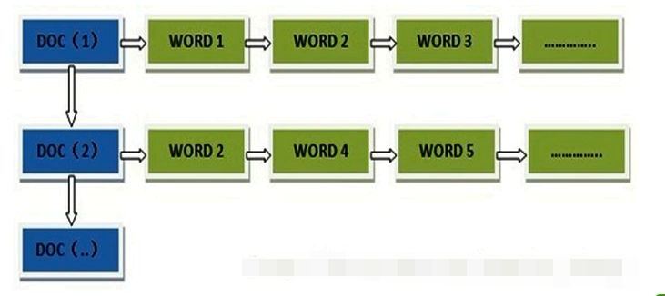

今天的文章，我们继续探讨搜索引擎，和大家聊聊搜索引擎最重要的一环——倒排索引。

在介绍倒排索引之前，我们先来看看什么是索引。索引是数据库当中的概念，百度百科中的说法是“索引是一种单独的、物理的对数据库表中一列或多列的值进行排序的一种存储结构”。可以简单地把索引当成是字典里的检索目录，我们比如我们要查一个叫“index”的单词，通过目录，可以快速地找到字母i开始的位置。索引也是一样，不过我们查找的不再是单词的首字母，而是数据。

在之前介绍搜索引擎的文章当中，我们曾经说过，搜索引擎的爬虫爬取到网页的文本信息之后，会先进行分词，再进行存储。也就是说存储的不是完整的文档，而是文档当中的关键词信息。显然，搜索引擎当中包含的网页数量极为庞大，为了保证效率，我们必须要使用索引。

我们将每个网页称作是一个文档（document），为它准备一个文档Id，然后通过链表将文档当中的关键词串联起来。那么这个数据结构应该变成下面这个样子。

在这张图里面，我们通过文档的ID去查询文档当中包含的关键词信息。我们先查到对应的文档，再去查其中的id，这是一个符合我们日常思维的查询，所以被认为是一个“正向查询”。因此，这个索引结构被称为正向索引。

但是只有正向索引是不够的，比如用户搜索“北京大学”，我们可以拿到“北京”和“大学”两个关键词。我们希望的是可以通过这两个关键词检索出对应的文档，在这个时候，我们是不知道文档Id的。也就是说这是一个反向的查询，用字典做比喻，我们希望通过单词去查询它在词典当中的位置。

在我们只有正向索引的情况下，要做到这一点，我们必须遍历所有的文档，然后一一挑选出其中包含“北京”和“大学”关键词的文档。显然，这是不可取的。所以为了解决这个问题，我们必须建立一个反向的索引，通过关键词指向文档。这样，我们就可以快速通过关键词筛选出对应的文档信息了。

这个反向的索引就是倒排索引。

有了倒排索引之后，剩下的就方便多了。我们就可以很方便地根据关键词召回所有含有关键词的文档，之后，再通过相应的算法计算各个文档与关键词之间的相关联，就可以进行相关性筛选了。这也是之前介绍搜索引擎的时候，提到的相关性过滤。

整个倒排索引的技术应该不难理解，不过实际操作的时候，要复杂一些， 还会涉及很多优化。下面就介绍众多优化方案当中，应用最广泛的一种。

### ElasticSearch中的优化

说到倒排索引，不能不提ElasticSearch。ElasticSearch几乎可以说是全世界应用最广泛的开源搜索引擎了。从维基百科、GitHub再到百度、腾讯，以及无数的中小型公司，都离不开ElasticSearch的身影。它通过一套系统结合了搜索引擎、全文检索、结构化分析等众多功能，并且还有配置简单，性能出众等优点。

ElasticSearch身为分布式搜索引擎，巧妙的设计模式非常多，加上分布式系统本身的复杂性，可以研究的内容很多。今天这篇文章主要讲倒排索引，所以简单聊聊其中关于倒排索引的优化。

前文当中说了，我们通过对关键词设置倒排索引来达到关键词搜索的目的。从逻辑上看当然没有问题，但实际上问题不小。最大的问题就是这样的关键词实在是太多了，多还算了，而且这些关键词是没有顺序的，如果我们想要找到其中的某个，只能遍历所有的关键词表。这显然是我们不能接受的，这里必须要做优化。

一个最简单的优化就是对这些关键词进行排序，我们排序之后简历一个dictionary。有了dictionary之后，我们就可以通过二分查找一类的方式进行快速的搜索了。看似很完美，但还是有问题。

复杂度没有问题，$O(logN)$的复杂度是可以接受的，不能接受的是磁盘的读盘。因为这个dictionary实在是太大了，我们每次查找磁盘是需要开销的，每一次磁盘的随机读取需要消耗10ms的时间。对于一个高性能的系统来说，这同样是不能接受的。

我们要优化这个答案，就必须要减少磁盘的随机读取。

想要减少使用磁盘，最好的办法就是把数据放在内存里。但是我们前面说了，这个dictionary太大了，内存里很有可能放不下。所以我们必须再对它做简单的索引，比如：

A字母开头的关键词存放在x页
B字母开头的关键词存放在y页
……

这其实就是查字典的方法，问题是如果关键词都是英文的，当然可以这么做。然而，搜索引擎并不仅仅支持英文，关键词可能是各种语言，甚至是各种符号。而且即使是英文的，每个字母对应的索引的数量也不是相同的。比如s字母开头的单词特别多，而z开头的就非常少。如果这样简单操作，其实并不一定能提升运行效率。

所以为了解决这个问题，我们需要引入一个数据结构，即前缀树（Trie树）。

一棵前缀树大概长下面这个样子：

前缀树的原理并不难，其实就是把前缀相同的字符串映射到树上的同一个分叉当中。每个分叉的末端记录的是这个前缀对应的内容的位置。其实也就是说将原本扁平化存储的索引，映射到了树上。不过，前缀树当中并不会存储所有的索引，只会存储关键词的一些前缀。通过前缀，我们可以找到dictionary当中的某个位置，之后再从这个位置开始往后顺序查找，如此就避免了过多使用硬盘的随机寻址，从而节省了时间开销。

用下图举个例子：

比如我们要查找的关键词是“Access”，通过前缀树我们先查到A这个前缀对应的dictionary的位置，也就是图中的Ada的位置。之后我们从Ada往后顺序遍历，直到找到Access为止。通过合理地构建前缀树，我们可以控制遍历dictionary的开销，从而达到优化的目的。

除了这些之外，ElasticSearch还在联合索引的查询以及索引合并上做了一些优化。由于牵扯到一些其他的技术和数据结构，篇幅限制，这里不做过多赘述。会在之后的文章和大家分享。

衷心希望大家学有收获，如果喜欢本文，请点击“在看”或者顺手转发吧~

> 参考资料
https://www.cnblogs.com/zlslch/p/6440114.html
https://zhuanlan.zhihu.com/p/94181307
https://zhuanlan.zhihu.com/p/33671444

