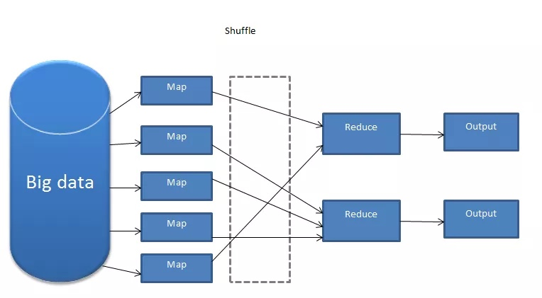

今天我们继续Python系列，给大家介绍的是Python当中三个非常神奇的方法：map、reduce和filter。

不知道大家看到map和reduce的时候有没有什么感觉，如果看过之前我们大数据系列介绍MapReduce文章的同学，想必有些印象。这个MapReduce不是一个分布式的计算方法么，怎么又变成Python中的方法了？其实原因很简单，因为Python是一门很年轻的语言，它在发展的过程当中吸收了很多其他领域的精华，MapReduce就是其中之一。

对之前文章感兴趣的同学可以点击下方的链接，回顾一下之前MapReduce的内容。

[大数据基石——Hadoop与MapReduce](https://mp.weixin.qq.com/s?__biz=MzUyMTM5OTM2NA==&mid=2247483739&idx=1&sn=2111080662444c8e4f7bf10448e6d734&chksm=f9dafc70cead7566d54126ed9d78069f313132e3c094946303f6c820e39a49c3bb794dce3921&scene=21#wechat_redirect)

## map

map除了地图之外，另一个英文本意是映射。在C++和Java一些语言当中，将map进一步引申成了存储key和value映射结构的容器。Python对这点做了区分，KV结构的容器命名成了dict，即字典，而map则回到了它的本意，也就是映射。

我们都知道，在数学领域，映射也是函数的领域。一个自变量通过某种映射，对应到一个因变量。同样，在Python当中，map操作本质也是函数，不过它作用的范围不再是单个变量，而是一个序列。换句话说，通过map我们可以省去循环操作，可以自动将一个容器当中的元素套用一个函数。



举个简单的例子，比如我们有一个坐标，我们希望知道它距离原点的距离。这个问题很简单，我们写一个计算距离的函数就可以解决：

```python
def dis(point):
    return math.sqrt(point[0]**2 + point[1]**2)
```

那如果我有多个点需要计算距离，在map出现之前，我们只能用循环来解决问题：

```python
points = [[0, 1], [2, 4], [3, 2]]

for point in points:
    print(dis(point))
```

但是有了map之后， 我们可以省去循环的操作，整个代码简化成了一行：

```python
map(dis, points)
```

但是要注意，我们调用完map之后得到的结果不是一个list而是一个迭代器。我们直接将map返回的内容print出来，可以得到这样一个结果：

```python
>>> print(map(dis, points))
<map object at 0x107aad1d0>
```

这是一个类的标准输出，其实它返回的不是最后的结果，而是一个迭代器。我们在之前的文章当中已经介绍过了迭代器和生成器的相关概念，这里不多做赘述了，遗忘的同学可以点击下方链接回顾一下之前的内容：

## 链接

我们想要获得完整的内容也很容易，我们只需要将它转化成list类型即可：

```python
>>> print(list(map(dis, points)))
[1.0, 4.47213595499958, 3.605551275463989]
```
以上过程还可以进一步简化，还记得我们之前介绍过的匿名函数吗？由于dis函数在我们的程序当中只会在map中用到，我们完全没有必要单独创建一个函数，我们可以直接传入一个匿名函数搞定运算：

```python
map(lambda x: math.sqrt(x[0]**2 + x[1] ** 2), points)
```

简单总结一下，map操作其实执行的是一个映射。它可以自动地将一个序列当中的内容通过制定的函数映射成另一个结果，从而避免显示地使用循环来调用，在很多场景下可以大大地简化代码的编写，可以很方便地将一个序列整体转变成另一个结果。

## reduce

相比于map，reduce的操作稍稍难理解一点点。它也是规定一个映射，不过不是将一个元素映射成一个结果。而是将两个元素归并成一个结果。并且它并不是调用一次，而是依次调用，直到最后只剩下一个结果为止。

比如说我们有一个数组[a, b, c, d]和一个函数f，我们计算reduce(f, [a, b, c, d])其实就等价于f(f(f(a, b), c), d)。和map不同的是，reduce最后得到一个结果，而不是一个迭代器或者是list。

我们光说有些抽象，不妨来看一个例子，就看最简单的一个例子：reduce函数接收两个数，返回两个数的和。那么显然，我们依次调用reduce，得到的就是原数组的和。

```python
from functools import reduce

def f(a, b):
    return a + b
    
print(reduce(f, [1, 2, 3, 4]))
```

最终得到的结果当然是10，同样，我们也可以将reduce中的方法定义成匿名函数，一样不影响最终的结果。

```python
print(reduce(lambda x, y: x + y, [1, 2, 3, 4]))
```

## MapReduce

既然我们map和reduce都有了，显然我们可以将它们串联起来使用，也就是分布式系统当中MapReduce的做法。虽然如果不手动使用线程池的话，Python并不会起多个线程来加速运算，但是至少可以简化我们实现的代码。我们还是举经典的wordCount的例子，也就是文本计算词频。

套用map和reduce的功能，整个流程非常清晰，我们只需要在map阶段对文本进行分词，在reduce阶段对分词之后的结果进行汇总即可。

听着好像非常容易，但是你实际去上手是写不出来的。原因也很简单，因为hadoop当中的Map和Reduce中间还有一层map的操作，会自动地将key值相同的结果放到同一个reducer当中。在这个问题当中，key自然就是我们的word，由于相同的word被放到同一个reducer当中，我们只需要累加就行了。但是如果我们自己编写mapreduce的话，由于缺少了中间数据重排的步骤，所以导致不能实现。

要解决也简单，我们可以人为增加一个map阶段代替hadoop当中的重排。相当于做了一个MapMapReduce，我们来看代码：

```python
from collections import Counter, defaultdict

texts = ['apple bear peach grape', 'grape orange pear']

# 第一次map，将字符串转成数组，每个单词对应1
def mp1(text):
    ret = []
    words = text.split(' ')
    for word in words:
        ret.append((word, 1))
    return ret


# 第二次map，将数组转成dict
def mp2(arr):
    d = defaultdict(int)
    for k, v in arr:
        d[k] += v
    return d

# reduce，合并dict
def rd(x, y):
    x.update(y)
    return x

print(reduce(rd, map(mp2, map(mp1, texts))))
```

那如果我们不用多次MapReduce呢？也不是没有办法，需要取点巧，方法也简单只要使用之前我们讲解过的Counter类，就可以完美解决这个问题。我们来看代码：

```python
from collections import Counter

texts = ['apple bear peach grape', 'grape orange pear']

def mp(text):
    words = text.split(' ')
    return Counter(words)

print(reduce(lambda x, y: x + y, map(mp, texts)))
```

由于我们使用了Counter，所以我们在map阶段返回的结果就已经是词频的dict了，而在reduce阶段我们只需要将它们全部累加起来就OK了。

最后，我们来看下filter

## filter

filter的英文是过滤，所以它的使用就很明显了。它的用法和map有些类似，我们编写一个函数来判断元素是否合法。通过调用filter，会自动将这个函数应用到容器当中所有的元素上，最后只会保留运行结果是True的元素，而过滤掉那些是False的元素。

举个例子，假设我们想要保留list当中的奇数而过滤掉偶数，我们当然可以直接操作，比如：

```python
arr = [1, 3, 2, 4, 5, 8]

[i for i in arr if i % 2 > 0 ]
```

而使用filter会非常方便：

```python
list(filter(lambda x: x % 2 > 0, arr))
```

从这个例子当中可能看不出便捷，但是有的时候判断的条件可能非常复杂，我们判断的逻辑不能简单地在list定义当中表达出来，这个时候使用filter则会容易得多。

最后， 我们再看一个类似的用法。在itertools当中有一个方法叫做 compress，通过compress我们可以实现根据一个序列的条件过滤另一个序列。

举个简单的例子，假设，我们有两个数组：

```python
student = ['xiaoming', 'xiaohong', 'xiaoli', 'emily']
scores = [60, 70, 80, 40]
```

我们想要获取所有考试及格的同学的list，如果用常规做法基本上免不了使用循环，但是使用compress可以很方便地通过一行代码实现：

```python
from itemtools import compress

>>> pass = [i > 60 for i in scores]
>>> print(pass)
[False, True, True, False]

>>> list(compress(student, pass))
['xiaohong', 'xiaoli']
```

需要注意的是filter和compress返回的都是一个迭代器，我们要获取它们的值，需要手动转换成list。

虽然在日常的开发当中不使用这三样神器同样可以工作，但是用上它们之后，会提升很多代码的可读性，节省很多无用的代码。尤其是在面试的时候，很有可能就会给面试官留下不一样的印象，也许结果也会不同。

今天的文章就是这些，如果觉得有所收获，请顺手点个关注吧，你们的举手之劳对我来说很重要。

